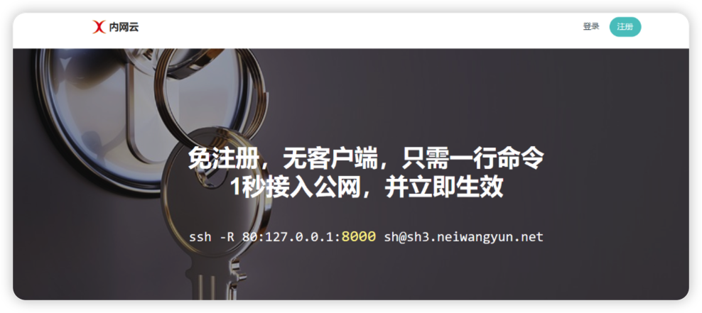
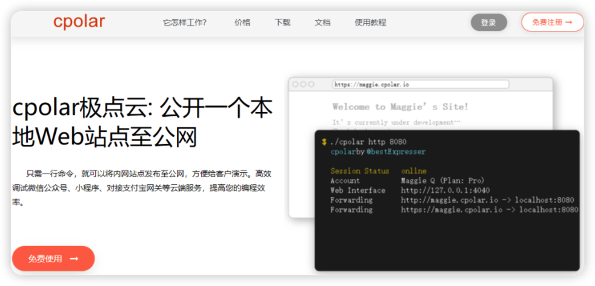

## 推荐 10 款简单好用的免费内网穿透工具

远程办公越来越普遍，但是如何应对在外远程桌面控制公司电脑、远程公司内网办公系统、调阅公司文件资料、远程公司内网服务器是个问题。而解决方案其实很简单，做内网穿透就可以突破局域网的限制，轻松实现公网访问内网，高效实现远程办公。

对于个人开发者来说，微信公众号或者在线支付系统需要一个环境进行开发调试；对于企业来说，居家办公或者出差在外的员工需要能够轻松访问到公司内网的办公系统。这些场景都可以通过内网穿透来解决，不需要公网 IP，也不用设置路由器，本地环境配置一个内网穿透工具即可。

而市面上已经有很多成熟的内网穿透工具，本文盘点了 10 款支持免费使用的国产内网穿透工具，可以参考选择适合的工具来下载使用。

### 内网穿透软件：

- NATAPP
- 内网云
- cpolar
- 花生壳
- 飞鸽
- 网云穿
- 闪库
- 快解析
- SAKURA FRP
- nat132

### 1. [NATAPP](https://natapp.cn/)

#### 免费版功能

- 支持 http/https/tcp 协议
- 必须实名认证
- 隧道数量：免费 2 条
- 免费带宽：1M
- 不限制流量

#### 1.1 优点

免费不限制流量

#### 1.2 缺点

- 需要实名认证
- 免费随机域名，不定时强制更换域名/端口

### 2. [内网云](https://www.neiwangyun.net/)

#### 免费版功能

- 免费带宽：2M
- 免费隧道：1 条
- 免费隧道有效时间：2 小时
- 无需安装客户端
- 支持 http/https/tcp 协议

#### 2.1 优点

- 不需要实名认证
- 使用简单，无需安装，一行命令行就可以穿透
- 默认生成 ipport、http、https 协议链接

#### 2.2 缺点

- 只能使用命令行形式，对小白使用不是很友好
- 免费地址有时间限制

### 3. [cpolar](https://www.cpolar.com/)

#### 免费版功能

- 支持 http/https/tcp 协议
- 支持永久免费使用
- 免费带宽：1M
- 不限制流量
- 隧道数量：免费 4 条
- 40 连接数/分钟
- 支持自主选择服务器地区（国内/国外）
- 支持在网站查看公网地址、端口

#### 3.1 优点

- 连接稳定，使用简单，教程完善
- 可自定义强，服务广泛、支持架构多
- http 隧道默认会创建 http 跟 https 公网地址
- 付费套餐目前支持 21 天退款保证

#### 3.2 缺点

- 免费公网地址 24 小时内随机变化（可升级套餐配置固定地址使用，付费套餐性价比高）

### 4. [花生壳](https://hsk.oray.com/)

#### 免费版功能

- 免费带宽：1M
- 免费隧道：2 条
- 限制流量：1G/月
- 并发连接数：50 个
- 需要实名认证
- 支持在网站查看远程端口

#### 4.1 优点

- 信誉保障，教程比较完善

#### 4.2 缺点

- 有流量限制，只有 1 个 G
- 需要实名认证，连接不是很稳定
- 使用 http(s)协议，需要 6 元认证费

### 5. [飞鸽](https://www.fgnwct.com/index.html)

#### 免费版功能

- 免费带宽：0.5M
- 免费隧道：1 条
- 无需安装，解压即用
- 支持 http/tcp/udp 协议
- 可自定义域名
- 20 并发连接

#### 5.1 优点：

- 不限制流量
- 使用简单
- 可自定义域名

#### 5.2 缺点：

- 免费套餐带宽小
- 免费隧道需要签到才可叠加使用时长

### 6. [网云穿](https://www.xiaomy.net/)

#### 免费版功能

- 免费隧道：1 条
- 免费带宽：1M
- 限制流量：1G/月
- 支持 http(s)/tcp/udp 协议
- 7 天后锁定只能使用 tcp 协议

#### 6.1 优点

- 使用简单

#### 6.2 缺点

- 限制流量
- 每个月需操作重新激活使用
